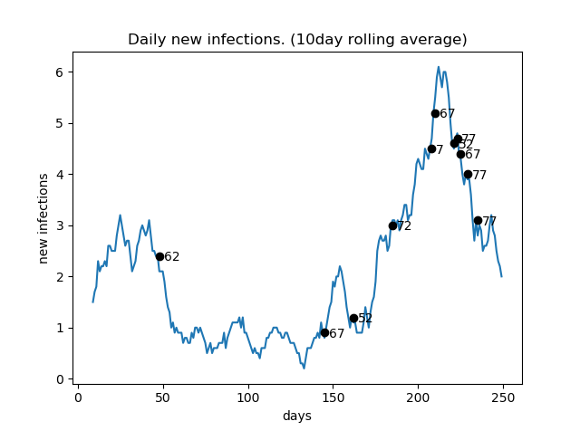
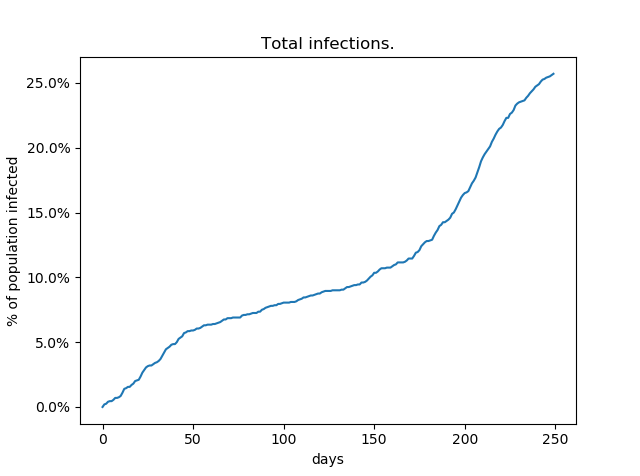
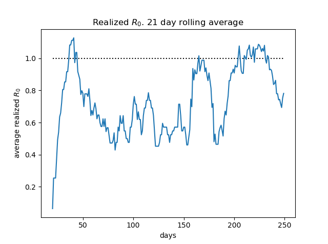
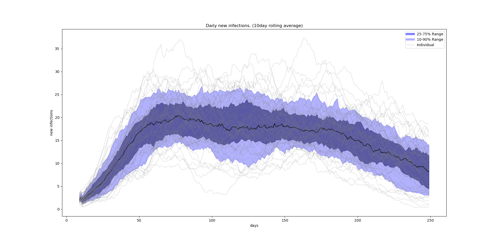
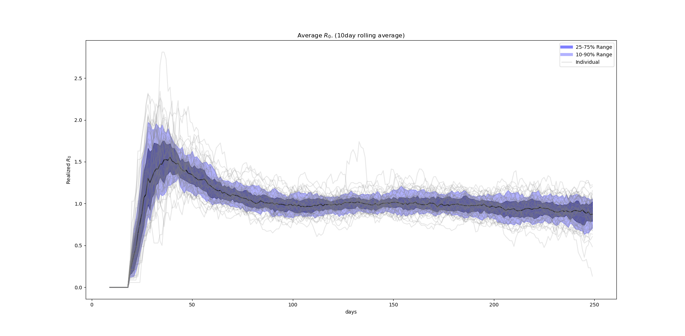
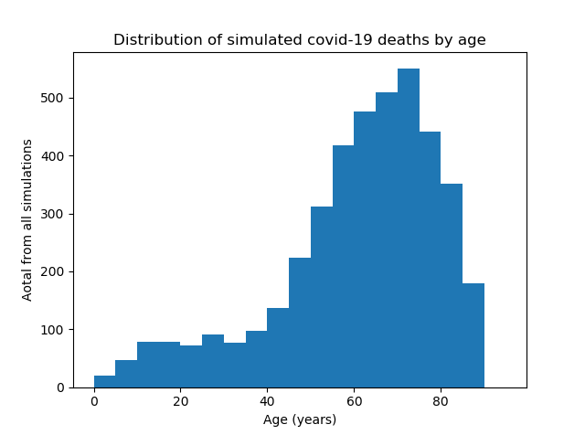
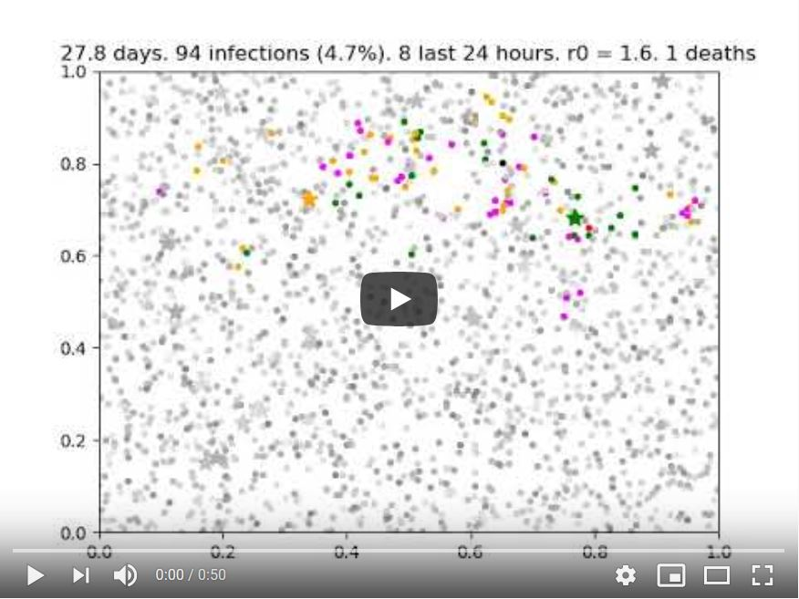

# Covid Vaccine Strategy for South Africa

Inspired by the work [Grauer2020], we attempt to answer the question of how to optimally administer a limited
supply of covid-19 vaccines in order to minimize deaths.

There are two extra features that we believe could be interesting to add to the Grauer method:
 
 1. That Mortality increases with age, and
 2. That there could be highly connected individuals like shops workers, taxi drivers, security personal etc.
 
There are several strategies that can be considered for administering the vaccine for example.
 
 1. Give to those most at risk of succumbing to the disease
 2. Give to areas that have the highest infection rate
 3. Give uniformly to the population
 4. Give to people who come into contact with the most other people

Strategy 1. appears to the the most popular and is being rolled out in several countries but we suspect that 
4. could lead to lower total deaths.
 
Investigating 1. and 4. require the above proposed modifications to the original model.

## Method

We model N agents who move through "social distance" space following Brownian motions. Infected agents can 
infect susceptible agents in the same patch of space. Agents start uniformly distributed in space and the 
patches in which infections can take place are squares with size such that the expected number of 
agents in each square is a constant. The initial agents are simulated with ages based on the 2011 South
 African census. 

## Results 

### Example with video

The above (loosely described) model has been implemented in ```simulation.py``` and below is an indication
of what it produces

Parameters:

|Parameter|Value|
|---|---|
|N|2000|
|in patch|10|
|||


Click on the following image to watch a youtube video of an example simulation:

[](http://www.youtube.com/watch?v=7wdFTtFDvIw)

The dots in the video have the following meaning:

|Colour|Meaning|
|---|---|
|Light Gray|Younger agents who can get the disease.|
|Dark Gray|Older agents who can get the disease.|
|Pink|Infected but no symptoms yet|
|Orange|Mild infection|
|Red|Severe infection (higher mortality|
|Green|Immune|
|Black|Dead|  


This simulation runs for 250 days and produces the following population dynamics: 



Black dots represent deaths and the ages of the simulated agents that died. 





### Multiple Runs

With similar parameters to above but with 6000 agents and run 60 times we get the following results:





With more agents and repeated simulations we are also able to investigate the total number of deaths
with a little more reliability:

.

The multiple rusn are produces by executing the same simulation from the above example but with the 
results saved to files that are then used by ```analysis.py```

### Highly connected agents

We now add highly connected individuals

|Parameter|Value|
|---|---|
|N|2000|
|in patch|10|
|Proportion of Connected|1%|
|Connected speed multilpier|10x|

[](http://www.youtube.com/watch?v=3mZx4Y0b6AU)

## Issues

The current implementation is too slow to run with more than several thousand agents. Because the mortality 
is around 2% that means that even when 20% of a population of 10000 has had Covid-19, one would only expect
40 deaths. There is a lot of numerical noise in such a small number so it will be hard to measure the impact
of the vaccination strategies.
  

## Data

The mortality rates are based on the age of the agent and the severity of the infection.

### Age based mortality rates

[worldometers: coronavirus age and sex demographics](https://www.worldometers.info/coronavirus/coronavirus-age-sex-demographics/)

### Age distribution in population

[Wikipedia: Demographics_of_South_Africa - Age and sex distribution](https://en.wikipedia.org/wiki/Demographics_of_South_Africa#Age_and_sex_distribution).


## TODO:

 * Speed up the simulation
 * Run ensembles of simulations and see how many need to run before we get stable disease dynamics where the 
 strategies can be tested.
 * Add the "fast moving agents" who simulate highly connected people
 * Add the vaccination policies.


## References

[Grauer2020]: Grauer, J., Löwen, H. & Liebchen, B. *Strategic spatiotemporal vaccine distribution increases 
the survival rate in an infectious disease like Covid-19*. Sci Rep 10, 21594 (2020). 
[https://doi.org/10.1038/s41598-020-78447-3]